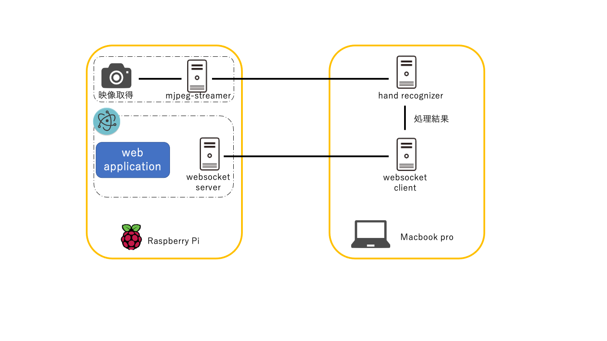
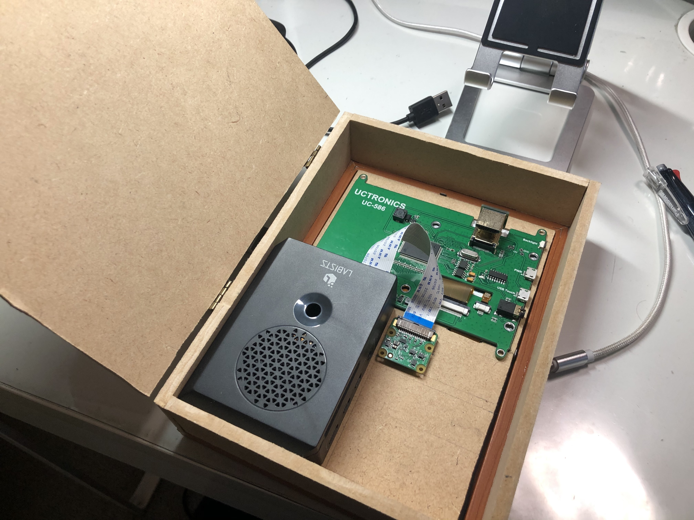
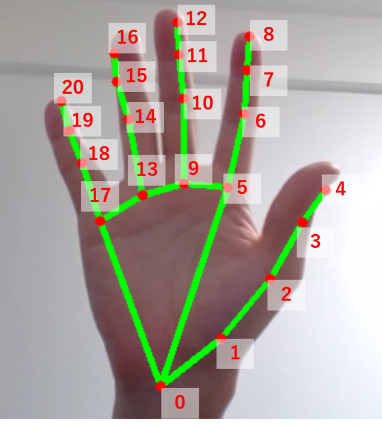

#SmartMirror

##背景
近年, 非接触型インターフェースが注目を浴びており, 
Hololens, OculusQuest2 に代表されるようなヘッドマウントディスプレイでは既に手の形およびそのジェスチャーを認識して操作を行うインタフェースが実装されている. 
しかし, これらには深度センサーなどの特殊な機材が必要となり, 高価であるという問題がある.
この解決策として, web カメラ等の安価な単眼カメラによる手の形状認識に関する研究が数多くなされている. 
最近の研究では, Google が 2019 年で発表した手の形状検出モデル (MediaPipe フレームワークを利用) が注目されている. 
本課題では, この Google による手の形状検出モデルを利用したハンドポーズ認識, およびハンドポーズの遷移に着目したハンドジェスチャー認識をインタフェースとして利用し, 非接触操作可能なスマートミラーを安価に開発した. 

##システム構成
###構成図

###構成
- Raspberry Pi: カメラ映像入力, アプリケーション
	- カメラ映像入力: mjpeg-streamer というソフトウェアを用いて映像をストリーミング配信
	- アプリケーション部: web アプリケーションの立ち上げ (html, css, javascript + electron)  
ジェスチャーおよびポーズの入力情報をサーバから websocket を通じて受け取り, モジュールの切り替えなどアプリケーション操作に反映する.

- 処理サーバ: MediaPipe による映像処理  
Raspberry Pi によるカメラ映像を受け取り, MediaPipeを利用してハンドポーズおよびハンドジェスチャーの解析 (Python).  
処理結果は websocket で Raspberry Pi に送信. 

- ハードウェア  
写真立てのアクリル部に車用の窓反射フィルムを貼り付け, マジックミラーを作成した. 
マジックミラーの内部にディスプレイを置くことで, スマートミラーを実現する. 
また, 外装は MDF 板を切り出して作成した. 

###ハンドポーズの認識
まず, Google の手の形状認識モデルを利用して, 指の関節等の位置座標 21 点を得る.

  
(https://dev.classmethod.jp/articles/mediapipe-recognize-hand-pose-with-multi-hand-tracking/より)  

次に, 各関節につながる 2 直線のなす角度を算出し, この角度に対して閾値を設定することで, 指を折り曲げているか, 伸ばしているかの状態を判定する. 
最後に, 各指の状態の組み合わせでハンドポーズを判定する.   
今回実装したハンドポーズは以下の通り. 

- ZERO: グーの形
- ONE: 人差し指のみを立てた形
- TWO: 人差し指, 中指を立てた形
- THREE: 人差し指, 中指, 薬指を立てた形
- FOUR: 人差し指, 中指, 薬指, 小指を立てた形
- FIVE: パーの形
- FOX: 狐の形
- PINCH: OK を意味するハンドポーズで何かを摘んでいるような形

###ハンドジェスチャーの認識  
- 左右入力: FIVE のポーズをとった状態で手を左右に振る (離散値)
- 上下入力: PINCH のポーズをとった状態で手を上下に移動させる (連続値) 

###スマートミラーの操作
- ONE, TWO, THREE, FOUR を入力:
各ポーズに対応したモジュール (後述のモジュール 1 ~ 4 に対応)を表示する.  
- ZERO を入力: モジュール表示をオフにする.
- FOX を入力: 左右 or 上下入力以外の操作を受け付けなくする. 再度 FOX 入力で解除

###モジュール
本課題にあたって, 4 つのモジュールを作成した. 
以下に実装したモジュールを示す. 

1. カレンダー
2. 天気予報
3. 時計
4. 音楽プレーヤー(iTunes の試聴音源取得 API を使用)

4 の音楽プレーヤーでは, 上下入力による音量調整, 左右入力による曲選択の操作が可能となっている. 

##実行方法
1. Raspberry Pi 上で `run-mirror.sh` を起動し, 映像のストリーミング配信, websocketサーバの立ち上げをする. 
2. 処理サーバ側で `run-server.sh` を起動し, websocket サーバに接続. 映像のストリーミング配信を受け取って処理をし, websocket で処理結果を渡す. 

##デモ
`demo_movie` ディレクトリ下にデモ動画をアップロードした. 

- `デモ1.MOV`: 各ハンドポーズによるモジュールの表示, 操作
- `デモ2.mov`: 音楽プレーヤーモジュールの改良

##参考文献
- [MagicMirror2](https://magicmirror.builders/)
- [MediaPipe](https://github.com/google/mediapipe)  
- [【MediaPipe】Landmarkデータから手のポーズを認識するため、”指の状態”を認識する（その１）](https://dev.classmethod.jp/articles/mediapipe-recognize-hand-pose-with-multi-hand-tracking/)
- 自然な手振りによる直感的なハンドジェスチャUI. 中洲俊信, 大平英貴, 池司, 内一成, 岡田隆三. ヒューマンインタフェース学会論文誌. pp.25-38. 2013. 